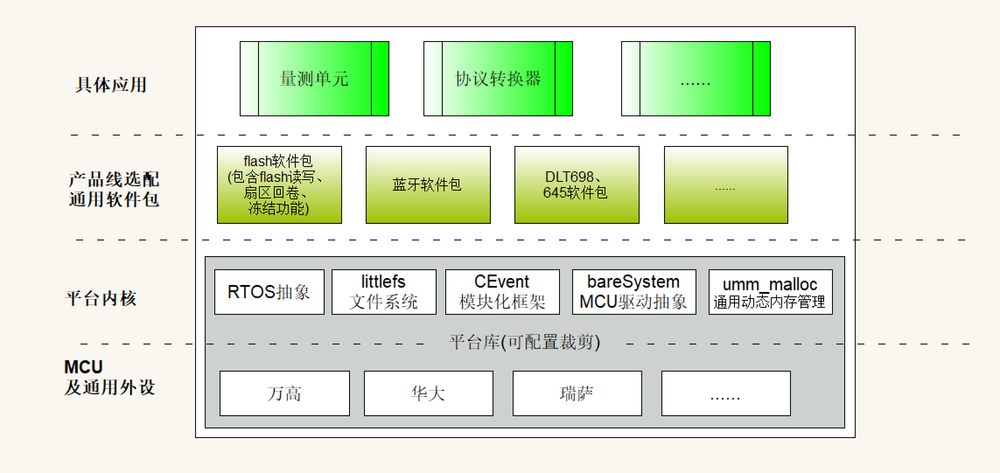

.. 智能断路器产品线文档集 documentation master file, created by
   sphinx-quickstart on Sat Oct  5 14:12:53 2024.
   You can adapt this file completely to your liking, but it should at least
   contain the root `toctree` directive.

公司平台构建
==================================================

平台架构图：

.. toctree::
   :maxdepth: 2
   :numbered:

   流程与工具/index
   平台架构介绍
   内核层/index
   

