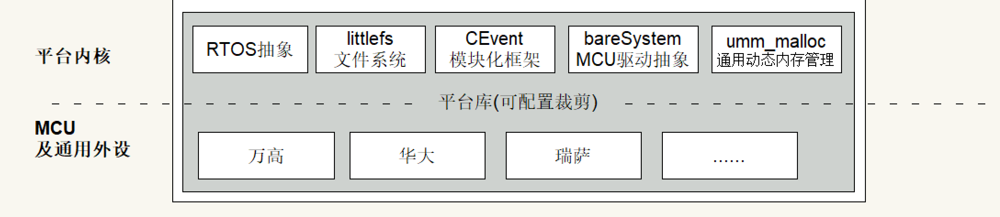

.. 智能断路器产品线文档集 documentation master file, created by
   sphinx-quickstart on Sat Oct  5 14:12:53 2024.
   You can adapt this file completely to your liking, but it should at least
   contain the root `toctree` directive.

内核介绍
==================================================

=================================================

.. toctree::
   :maxdepth: 2
   :caption: Contents:

   RTOS抽象
   littlefs文件系统
   CEvent模块化框架
   bareSystemMCU驱动抽象框架
   UMM_MALLOC通用动态内存管理

