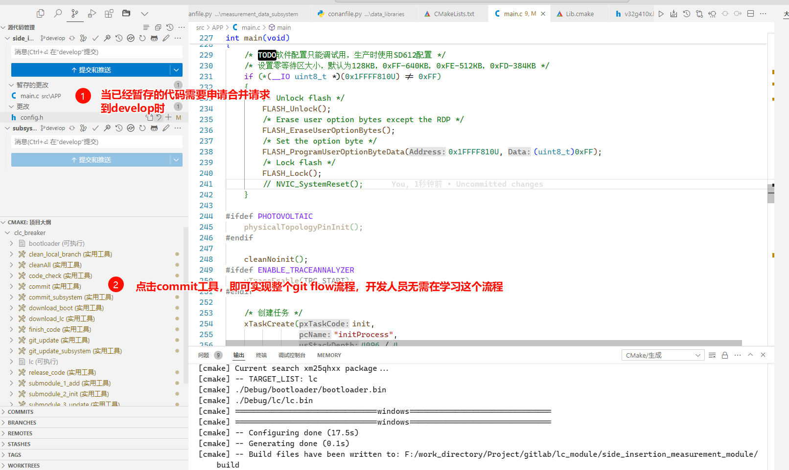
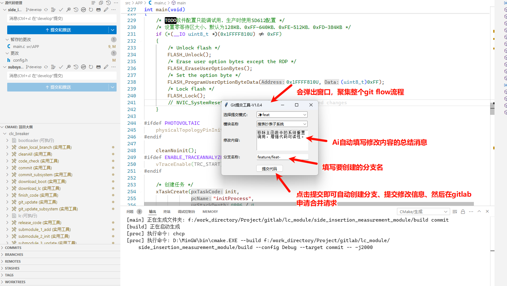

git flow协作开发流程
==================================================

Git Flow 简介
--------------------------------------------------

Git Flow 是一种基于 Git 的工作流程模型,它定义了一套严格的分支管理策略。这种模型非常适合具有计划发布周期的项目。Git Flow 的核心思想是使用不同的分支来管理功能开发、发布准备和维护等不同阶段的工作。

.. image:: https://wac-cdn.atlassian.com/dam/jcr:a9cea7b7-23c3-41a7-a4e0-affa053d9ea7/04%20(1).svg?cdnVersion=1292
   :alt: Git Flow 工作流程图
   :align: center

主要分支:

1. master: 主分支,存放稳定的生产版本代码
2. develop: 开发分支,用于集成功能分支的代码

辅助分支:

1. feature: 功能分支,用于开发新功能
2. release: 发布分支,用于准备新的生产版本
3. hotfix: 热修复分支,用于修复生产环境中的紧急问题

.. note::
   Git Flow 的分支策略可以有效地管理复杂的项目开发流程，提高团队协作效率。

自动化工具实现
--------------------------------------------------

为了简化 Git Flow 的使用流程,我们开发了一套自动化工具。这个工具通过简单的鼠标点击就可以完成整个 Git Flow 流程,大大提高了开发效率。

工具的主要特点:

1. **一键操作:** 通过图形界面,开发者只需点击几下鼠标就能完成分支的创建、合并等操作。
2. **AI 辅助:** 集成了 GPT 模型,能够自动生成符合规范的代码修改总结。
3. **标准化提交:** 自动生成的提交信息符合团队约定的格式标准。

.. tip::
   使用自动化工具可以大大减少人为错误，提高开发效率。

工具优势
--------------------------------------------------

1. **提高开发效率:** 通过自动化工具,开发者可以快速完成分支操作,节省了大量手动输入的时间。
2. **减少人为错误:** 自动化工具可以减少因手动操作失误导致的错误,提高代码提交的准确性。
3. **促进团队协作:** 统一的流程和工具可以促进团队成员之间的协作,减少沟通成本。
4. **标准化流程:** 通过工具的实现,可以强制统一团队的开发流程,提高代码质量和可维护性。
5. **灵活扩展:** 可以根据团队的需求进行定制和扩展,满足不同项目的需求。
6. **统一提交信息:** 通过工具的实现,可以强制统一团队的提交信息格式,方便后续的代码审查和统计分析。
7. **AI 辅助:** 集成了 GPT 模型,能够自动生成符合规范的代码修改总结。

.. admonition:: 重要提示
   :class: important

   合理使用 Git Flow 和自动化工具可以显著提升团队的开发效率和代码质量。

代码实现及原理
--------------------------------------------------

以下是该工具的完整核心代码实现:

.. code-block:: python
   :linenos:

   import tkinter as tk
   from tkinter import ttk, messagebox
   import subprocess
   import webbrowser
   import sys
   from tkinter import simpledialog
   import os
   from gpt import generate_commit_message

   # 获取执行路径参数
   if len(sys.argv) > 1:
       dir = sys.argv[1]
   else:
       dir = './'

   commit_AI_message = ""

   def get_git_diff(dir):
       os.chdir(dir)
       try:
           DIFF = subprocess.check_output(
               ['git.exe', 'diff', '--cached'], cwd=dir).decode('utf-8', errors='ignore')
       except subprocess.CalledProcessError:
           DIFF = ""
       if not DIFF:
           commit_AI_message = "暂存区无代码变更,注意检查是否暂存文件"
       else:
           if len(DIFF) > 4000:
               DIFF = DIFF[:4000]
       return DIFF

   class EditDialog(simpledialog.Dialog):
       def __init__(self, parent, title=None, text=None):
           self.text = text
           super().__init__(parent, title=title)

       def body(self, master):
           self.title("编辑提交信息")
           self.text_widget = tk.Text(master, width=50, height=10)
           self.text_widget.insert('1.0', self.text)
           self.text_widget.pack()
           self.text_widget.bind("<Return>", self.insert_newline)
           return self.text_widget

       def insert_newline(self, event):
           self.text_widget.insert(tk.INSERT, "\n")
           return "break"

       def buttonbox(self):
           box = tk.Frame(self)
           ok_button = tk.Button(box, text="确定", width=10,
                                 command=self.ok, default="active")
           ok_button.pack(side="left", padx=5, pady=5)
           cancel_button = tk.Button(
               box, text="取消", width=10, command=self.cancel)
           cancel_button.pack(side="left", padx=5, pady=5)
           self.bind("<Escape>", self.cancel)
           box.pack()

       def apply(self):
           self.result = self.text_widget.get('1.0', 'end').strip()

       def ok(self, event=None):
           self.withdraw()
           self.update_idletasks()
           self.apply()
           self.cancel()

   def commit_code():
       commit_mode = mode_var.get()
       module_name = module_entry.get()
       change_description = change_entry.get('1.0', 'end')
       branch_name = branch_entry.get()
       commit_message = f'{commit_mode}({module_name}): {change_description}'

       if not commit_mode or not module_name or not change_description or not branch_name:
           messagebox.showwarning("输入错误", "所有输入框都必须有内容。")
           return

       try:
           subprocess.check_output(
               ['git.exe', 'diff', '--cached', '--quiet'], cwd=dir)
       except subprocess.CalledProcessError:
           pass
       else:
           messagebox.showwarning("无变更", "暂存区没有任何代码变更。")
           return

       try:
           current_branch = subprocess.check_output(
               ['git.exe', 'rev-parse', '--abbrev-ref', 'HEAD']).strip().decode()
           if current_branch != 'develop':
               continue_operation = messagebox.askyesno(
                   "分支错误", "当前分支不是 develop 分支。是否继续操作？\n(如果继续，则不会创建新分支，将在当前分支上提交代码)")
               if not continue_operation:
                   return
           else:
               existing_branches = subprocess.check_output(
                   ['git.exe', 'branch'], cwd=dir).decode().splitlines()
               branch_exists = False

               for branch in existing_branches:
                   if branch.strip() == branch_name:
                       branch_exists = True
                       break

               if branch_exists:
                   delete_branch = messagebox.askyesno(
                       "分支已存在", "本地分支已存在，是否删除并继续操作？")
                   if delete_branch:
                       subprocess.run(['git.exe', 'branch', '-D',
                                      branch_name], check=True, cwd=dir)
                   else:
                       return
               try:
                   result = subprocess.run(
                       ['git.exe', 'checkout', '-b', branch_name], check=True, cwd=dir, stderr=subprocess.PIPE)
               except subprocess.CalledProcessError as e:
                   messagebox.showerror(
                       "Git 错误", f"Git 命令执行失败：{e}\n{result.stderr.decode()}")

           result = subprocess.run(
               ['git', 'diff', '--cached', '--numstat'],
               capture_output=True,
               text=True
           )

           added_lines = 0
           deleted_lines = 0

           for line in result.stdout.splitlines():
               parts = line.split('\t')
               if len(parts) > 1 and parts[0].isdigit() and parts[1].isdigit():
                   added_lines += int(parts[0])
                   deleted_lines += int(parts[1])

           print(f"Total added lines in staged changes: {added_lines}")
           print(f"Total deleted lines in staged changes: {deleted_lines}")

           change_description = change_entry.get('1.0', 'end')
           if change_description.endswith('\n'):
               change_description = change_description[:-1]
           commit_message = f'{commit_mode}({module_name}): {change_description}(新增行数:{added_lines},删除行数:{deleted_lines})'

           subprocess.run(['git.exe', 'commit', '-m',
                          commit_message], check=True, cwd=dir)

           subprocess.run(['git.exe', 'push', 'origin', 'HEAD'],
                          check=True, cwd=dir)

           subprocess.run(['git.exe', 'checkout', 'develop'], check=True, cwd=dir)

           subprocess.run(['git.exe', 'fetch', '--prune'], check=False, cwd=dir)

           remote_url = subprocess.check_output(
               ['git.exe', 'remote', 'get-url', 'origin'], cwd=dir).strip().decode()

           webbrowser.open(remote_url)

           messagebox.showinfo("提交成功", "代码提交成功！")

           root.destroy()

       except subprocess.CalledProcessError as e:
           messagebox.showerror("Git 错误", f"Git 命令执行失败：{e}")

   def update_branch_name(*args):
       mode = mode_var.get()
       mode = mode[1:]
       branch_name_default = f"feature/{mode}-"
       branch_entry_var.set(branch_name_default)

   root = tk.Tk()
   root.title('Git提交工具-V1.0.4')

   DIFF = get_git_diff(dir)
   prompt = "你是一个专业的AI开发助手,请根据以下 git diff 内容生成一条简短清晰的 git 提交消息，概括所有改动和特点，字数控制在一句话内，不要提问任何问题：\n"
   commit_AI_message = generate_commit_message(prompt, {DIFF})

   ttk.Label(root, text="选择提交模式：").grid(
       column=0, row=0, padx=5, pady=5, sticky=tk.W)
   mode_var = tk.StringVar()
   mode_combo = ttk.Combobox(root, textvariable=mode_var,
                             state="readonly", width=20)
   mode_combo['values'] = ('✨feat', '🐞fix', '📃docs',
                           '🌈style', '🦄refactor', '🔧build')
   mode_combo.grid(column=1, row=0, padx=0, pady=5, sticky=tk.W)
   mode_combo.current(0)
   mode_var.trace("w", update_branch_name)

   ttk.Label(root, text="模块名称").grid(column=0, row=1, padx=5, pady=5, sticky=tk.W)
   mode1_var = tk.StringVar()
   module_entry = ttk.Combobox(
       root, textvariable=mode1_var, state="readonly", width=20)
   module_entry['values'] = ('搜表抄表子系统', '计量子系统', '数据库', '闸位控制子系统',
                             '通信子系统', '监控子系统', 'cmake编译系统', '脚本工具', '协议维护', '通用修改')
   module_entry.grid(column=1, row=1, padx=0, pady=5, sticky=tk.W)
   module_entry.current(0)
   mode1_var.trace("w", update_branch_name)

   ttk.Label(root, text="修改内容：").grid(
       column=0, row=2, padx=5, pady=5, sticky=tk.W)
   change_entry = tk.Text(root, width=23, height=5)
   change_entry.grid(column=1, row=2, padx=0, pady=5, sticky=tk.W)
   change_entry.insert('1.0', commit_AI_message)

   ttk.Label(root, text="分支名称：").grid(
       column=0, row=3, padx=5, pady=5, sticky=tk.W)
   branch_entry_var = tk.StringVar()
   branch_entry = ttk.Entry(root, textvariable=branch_entry_var, width=23)
   branch_entry.grid(column=1, row=3, padx=0, pady=5, sticky=tk.W)
   update_branch_name()

   submit_button = ttk.Button(root, text="提交代码", command=commit_code)
   submit_button.grid(column=0, row=4, columnspan=2, pady=10)

   screen_width = root.winfo_screenwidth()
   screen_height = root.winfo_screenheight()

   x = (screen_width // 2) - (300 // 2)
   y = (screen_height // 2) - (200 // 2)

   root.geometry(f"310x210+{x}+{y}")

   for i in range(5):
       root.grid_rowconfigure(i, weight=1)
   root.grid_columnconfigure(0, weight=1)
   root.grid_columnconfigure(1, weight=3)

   root.grid_columnconfigure(1, weight=2)
   root.grid_rowconfigure(0, weight=2)
   root.grid_rowconfigure(1, weight=2)
   root.grid_rowconfigure(2, weight=2)
   root.grid_rowconfigure(3, weight=2)
   root.grid_rowconfigure(4, weight=2)

   root.mainloop()

这个工具通过自动化和AI辅助大大简化了Git Flow的使用流程，提高了开发效率，同时保证了提交信息的规范性。主要功能包括：

1. 获取Git差异
2. AI辅助生成提交信息
3. 图形界面操作
4. 分支管理
5. 代码提交自动化
6. 错误处理和用户交互
7. 提交后自动打开远程仓库网页

.. note::
   使用此工具时，请确保已正确配置Git环境，并且有相应的仓库访问权限。

