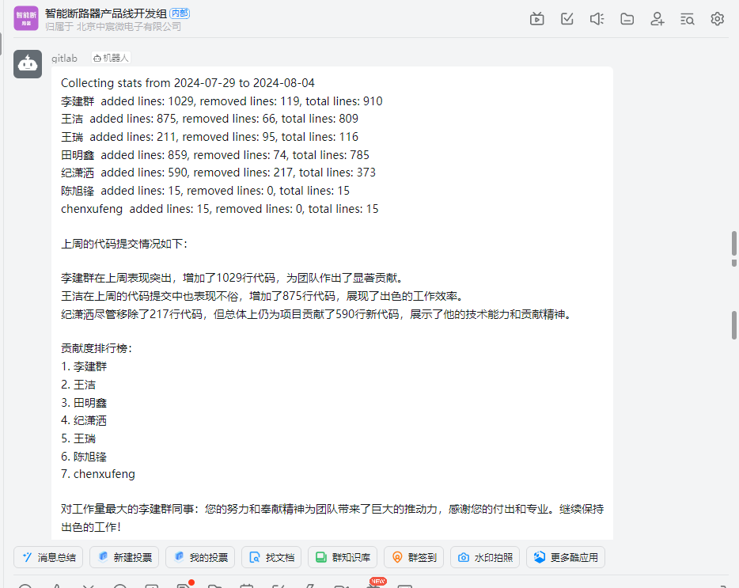

钉钉一周代码统计与鼓励推送
==================================================

简介
--------------------------------------------------

为了提高团队协作效率和激励开发人员，我们开发了一个自动化工具，可以定期统计项目组所有成员的代码工作量，并通过钉钉群自动推送统计结果和鼓励信息。这个工具的主要作用和意义包括：

.. note::
   1. 提供客观的工作量数据，帮助团队成员和管理者了解项目进展。
   2. 激励团队成员，通过公开表彰提高工作积极性。
   3. 促进良性竞争，鼓励团队成员互相学习和进步。
   4. 自动化统计过程，减少人工统计的工作量。
   5. 及时反馈，让团队成员能够及时调整工作节奏和方向。

功能介绍
--------------------------------------------------

该工具的主要功能如下:

.. admonition:: 核心功能
   :class: tip

   1. 每周自动统计：系统会在每周五下午5点自动统计本周内所有项目的代码提交情况。
   2. 多项目支持：可以同时统计多个Git仓库的代码变更。
   3. AI分析总结：利用OpenAI的GPT模型对统计数据进行分析,生成简洁的总结报告。
   4. 贡献度排行：根据新增代码行数对团队成员进行排名。
   5. 个性化鼓励：为工作量最大和最小的成员生成个性化的鼓励信息。
   6. 自动推送：将统计结果和AI生成的报告自动推送到指定的钉钉群。

效果展示
--------------------------------------------------

以下是一个典型的推送消息示例:

   
   图1: 钉钉代码统计推送效果展示

实现方式
--------------------------------------------------

该工具的实现主要包含以下几个部分:

.. topic:: 核心模块：

   **Git统计模块：** 使用Git命令行工具获取指定时间范围内的代码变更统计信息。主要统计指标包括新增代码行数、删除代码行数和总变更行数。

   **多仓库聚合：** 支持同时统计多个Git仓库的数据，并将结果聚合为一个总的统计报告。

   **AI分析模块：** 使用OpenAI的GPT模型对统计数据进行分析，生成人性化的总结报告和个性化鼓励信息。

   **定时任务：** 使用Python的定时任务模块，在每周五下午5点自动触发统计任务。

   **钉钉推送模块：** 利用钉钉机器人的API，将统计结果和AI生成的报告推送到指定的钉钉群。

工作流程
--------------------------------------------------

整个工具的工作流程如下:

.. code-block::

   +-------------------+
   |  开始定时任务     |
   +-------------------+
            |
            v
   +-------------------+
   | 遍历Git仓库目录   |
   +-------------------+
            |
            v
   +-------------------+
   | 执行代码变更统计  |
   +-------------------+
            |
            v
   +-------------------+
   |  聚合统计结果     |
   +-------------------+
            |
            v
   +-------------------+
   | AI生成分析报告    |
   +-------------------+
            |
            v
   +-------------------+
   |  推送到钉钉群     |
   +-------------------+
            |
            v
   +-------------------+
   |       结束        |
   +-------------------+

这个流程图展示了从定时任务触发到最终推送消息的整个过程。每个步骤都是工具功能的关键组成部分,确保了从数据收集到分析再到通知的完整工作流。

.. admonition:: 工作流程详解
   :class: note

   **1. 开始定时任务:** 每周五下午5点自动触发。

   **2. 遍历Git仓库目录:** 检查配置的所有Git仓库。

   **3. 执行代码变更统计:** 对每个仓库进行代码提交统计。

   **4. 聚合统计结果:** 将所有仓库的统计数据合并。

   **5. AI生成分析报告:** 使用OpenAI API生成分析和鼓励信息。

   **6. 推送到钉钉群:** 将统计结果和AI报告发送到指定的钉钉群。

   **7. 结束:** 完成本次统计和推送任务。

这个工作流程确保了整个过程的自动化和有序进行,从而提高了团队的工作效率和沟通质量。

配置说明
--------------------------------------------------

要使用此工具,需要进行以下配置:

.. admonition:: 配置项
   :class: important

   1. Git仓库路径：在配置文件中列出需要统计的所有Git仓库路径。
   2. OpenAI API密钥：配置用于AI分析的OpenAI API密钥，或者国产密钥也可以。
   3. 钉钉机器人：设置钉钉机器人的access token和安全设置。
   4. 定时任务设置：配置定时任务的执行时间(默认为每周五下午5点)。

使用说明
--------------------------------------------------

.. admonition:: 使用步骤
   :class: tip

   1. 安装依赖：确保已安装所有必要的Python库，如requests, openai等。
   2. 配置：按照配置说明设置所有必要的参数。
   3. 运行：执行主脚本，启动定时任务。
   4. 测试：可以使用测试模式手动触发统计和推送，以验证功能是否正常。

注意事项
--------------------------------------------------

.. warning::

   1. 确保Git仓库路径配置正确，且有足够的访问权限。
   2. OpenAI API密钥需要妥善保管，避免泄露。
   3. 钉钉机器人的安全设置要合理配置，防止消息被滥用。
   4. 定期检查和维护脚本，确保统计服务的稳定性。
   5. 根据团队需求，可以进一步自定义统计指标和报告格式。

代码实现
--------------------------------------------------

以下是该工具的核心代码实现及其详细注释:

1. Git统计函数

.. code-block:: python
   :linenos:
   :emphasize-lines: 3,21,39

    def get_code_changes(repo_path, since, until):
        try:
            # 切换到指定的Git仓库目录
            os.chdir(repo_path)
            
            # 检查是否是有效的Git仓库
            if not os.path.exists(os.path.join(repo_path, '.git')):
                print(f"Error: {repo_path} 不是一个有效的Git仓库")
                return
            
            # 获取所有作者的列表
            command_get_authors = ["git", "log", "--format=%aN"]
            authors_output = subprocess.check_output(command_get_authors, shell=True, text=True, encoding='utf-8').strip()
            authors = sorted(set(authors_output.split('\n')))

            result = ""
            for name in authors:
                if name.strip() == '':
                    continue
                result += f"{name}\t"
                
                # 构建Git命令来获取特定作者在指定时间范围内的代码统计
                command_get_stats = [
                    "git", "log", f"--author={name}", f"--since={since}", f"--until={until}",
                    "--pretty=tformat:", "--numstat"
                ]
                output = subprocess.check_output(command_get_stats, shell=True, text=True, encoding='utf-8')

                # 初始化统计变量
                add, subs, loc = 0, 0, 0
                
                # 解析Git输出，计算添加、删除和总行数
                for line in output.splitlines():
                    parts = line.split()
                    if len(parts) == 3 and parts[0].isdigit() and parts[1].isdigit():
                        try:
                            add += int(parts[0])  # 添加的行数
                            subs += int(parts[1])  # 删除的行数
                            loc += int(parts[0]) - int(parts[1])  # 净变更行数
                        except ValueError:
                            result += f"Warning: Failed to parse line: {line}\n"

                # 将该作者的统计结果添加到结果字符串
                result += f"added lines: {add}, removed lines: {subs}, total lines: {loc}\n"
        except Exception as e:
            print(f"An unexpected error occurred: {e}")
            
        return result

2. 多仓库聚合函数

.. code-block:: python
   :linenos:
   :emphasize-lines: 3,7,11

    def aggregate_stats(directories, since, until):
        all_strings = []
        # 遍历所有配置的Git仓库目录
        for directory in directories:
            # 获取每个仓库的代码变更统计
            output = get_code_changes(directory, since, until)
            output = output.split('\n')
            all_strings.append(output)
        # 处理并合并所有仓库的统计数据
        stats = process_strings(all_strings)
        print(stats)
        return stats

3. AI分析函数

.. code-block:: python
   :linenos:
   :emphasize-lines: 3-10,15-20,24

    def generate_commit_message(prompt="", quuestion=''):
        # 配置OpenAI客户端
        client = OpenAI(
            base_url="https://api.xty.app/v1",
            api_key="xxxxxxxxxxxxxxxxxxxxxxxxxxxxxxxxxxxxxxxxx",
            http_client=httpx.Client(
                base_url="https://api.xty.app/v1",
                follow_redirects=True,
            ),
        )

        try:
            # 调用OpenAI API生成分析报告
            response = client.chat.completions.create(
                model="gpt-3.5-turbo-16k-0613",
                messages=[
                    {"role": "system", "content": "respond in chinese"},
                    {"role": "user", "content": f"{prompt}\n{quuestion}"}
                ],
            )
            # 提取生成的消息内容
            commit_AI_message = response.choices[0].message.content
        except Exception as e:
            print(f"API call failed: {e}")
            commit_AI_message = "调用API失败"

        return commit_AI_message

4. 定时任务函数

.. code-block:: python
   :linenos:
   :emphasize-lines: 6-7,12-13,18-19,24-25,31-32

    def schedule_task(test=False):
        while True:
            # 获取当前时间
            current_time = time.localtime()
            
            # 检查是否是周五下午5点
            if current_time.tm_wday == 4 and current_time.tm_hour == 17:
                # 获取本周的起始和结束日期
                since, until = get_current_week()
                
                # 获取聚合的统计数据
                aggregated_stats = aggregate_stats(directories, since, until)
                aggregated_stats += "\n"
                
                # 准备AI分析的提示
                prompt = "我给你提供了本周的代码提交统计，你可以对每个人的代码提交情况进行分析和总结。你需要生成一段简短的话来描述这周的代码提交情况。在最后列出贡献度排行榜，贡献度只需要看增加的代码不看减少的代码，然后给工作量最大的人和最小的人各写一段鼓励的话。不用任何解释和回复。"
                
                # 生成AI分析报告
                gpt_message = generate_commit_message(prompt, aggregated_stats)
                gpt_message += "\n数据来自git统计.\n"
                
                # 根据测试模式决定是否发送消息
                if not test:
                    send_dingtalk_message(aggregated_stats+gpt_message)
                else:
                    send_message = input("是否发送消息？(y/n): ")
                    if send_message.lower() == "y":
                        print(aggregated_stats+gpt_message)
                        send_dingtalk_message(aggregated_stats+gpt_message)
            
            # 每小时检查一次
            time.sleep(3600)

5. 钉钉推送函数

.. code-block:: python
   :linenos:
   :emphasize-lines: 3,7,11,15-21,26,31

    def send_dingtalk_message(msg='测试'):
        # 钉钉机器人的access token
        access_token = "7b9cc8f4af03d04602aa66dd738cf08eb23e07f872b94516136c0aaa2b4ab240"

        # 设置请求头
        headers = {'Content-Type': 'application/json;charset=utf-8'}
        # 构建钉钉机器人API的URL
        url = f"https://oapi.dingtalk.com/robot/send?access_token={access_token}"

        # 在消息末尾添加换行符
        msg += "\n"

        # 构建请求数据
        data = {
            "msgtype": "text",
            "at": {
                "isAtAll": True  # 是否@所有人
            },
            "text": {
                "content": msg  # 消息内容
            }
        }
        
        # 发送POST请求
        response = requests.post(url, headers=headers, data=json.dumps(data))

        # 检查响应状态
        if response.status_code == 200:
            print("消息发送成功")
        else:
            print(f"消息发送失败，错误码：{response.status_code}")

这些函数共同工作，实现了自动化的代码统计、AI分析和钉钉推送功能。定时任务函数作为主要的控制流，协调其他函数的调用，确保整个过程按计划执行。每个函数都有其特定的职责，从获取Git统计数据到生成AI分析报告，再到最终的消息推送。

.. tip::
   通过这种模块化的设计，我们可以轻松地扩展或修改系统的功能，以适应团队的不同需求。