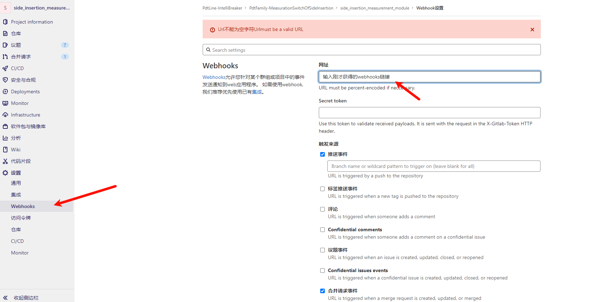

钉钉合并请求推送
==================================================

简介
--------------------------------------------------

为了提高团队协作效率,我们可以将GitLab的合并请求(Merge Request)消息推送到项目管理群,方便项目负责人及时查看和审核代码。这种集成不仅能够加快代码审核流程,还能促进团队成员之间的实时沟通。

效果展示
--------------------------------------------------

实现方式
--------------------------------------------------

实现钉钉合并请求推送主要包含以下步骤:

1. 创建钉钉机器人
^^^^^^^^^^^^^^^^^^^^^^^^^^^^^^^^^^^^^^^^^^^^^^^^^^

在钉钉群中创建自定义机器人:

a. 进入钉钉群设置
b. 选择"群机器人"
c. 点击"添加机器人" > "极狐gitlab"

   
d. 设置机器人名称

e. 获取并保存Webhook地址

.. tip::
   请妥善保管Webhook地址!

2. 配置GitLab Webhooks
^^^^^^^^^^^^^^^^^^^^^^^^^^^^^^^^^^^^^^^^^^^^^^^^^^

在GitLab项目中设置Webhooks:

a. 进入项目设置 > Webhooks
b. 填写URL(使用钉钉机器人的Webhook地址)
c. 选择触发事件(Merge requests events)
d. 添加Webhook

注意事项
--------------------------------------------------

1. 确保钉钉机器人的安全设置得当，避免消息被滥用。
2. 根据团队需求，可以适当选择事件通知。
3. 定期检查和维护Webhook，确保推送服务的稳定性。

.. warning::
   请注意保护您的Webhook URL，不要将其泄露。

通过以上步骤，我们就可以实现GitLab合并请求自动推送到钉钉群的功能，提高团队协作效率。

.. note::
   如果您在配置过程中遇到任何问题，请随时联系我。
