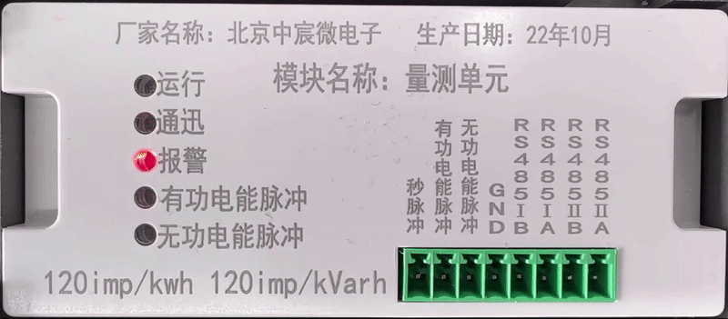
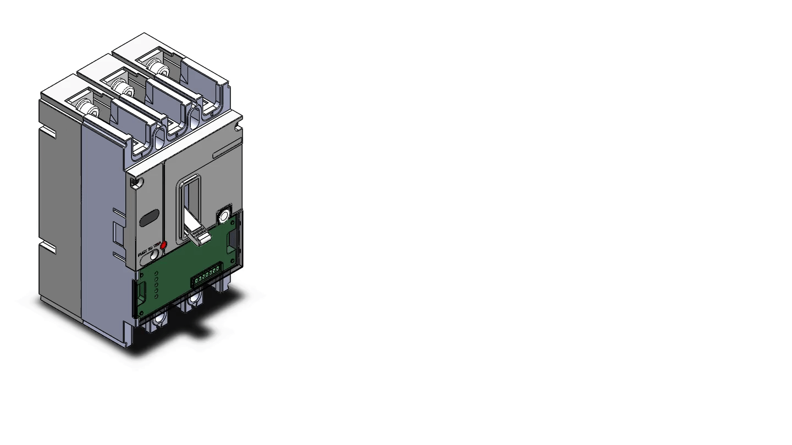
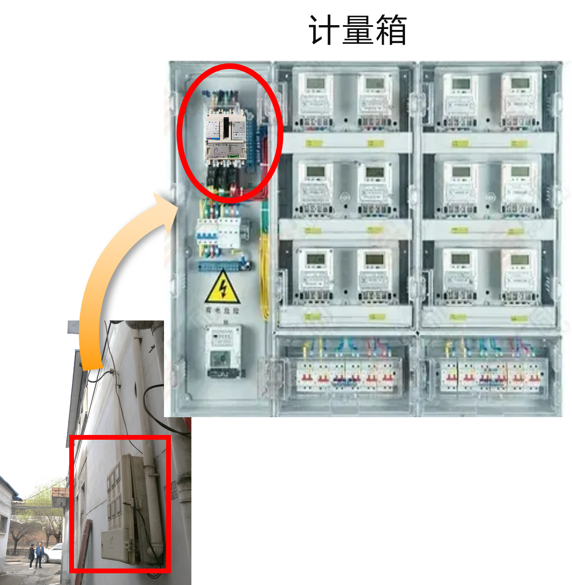
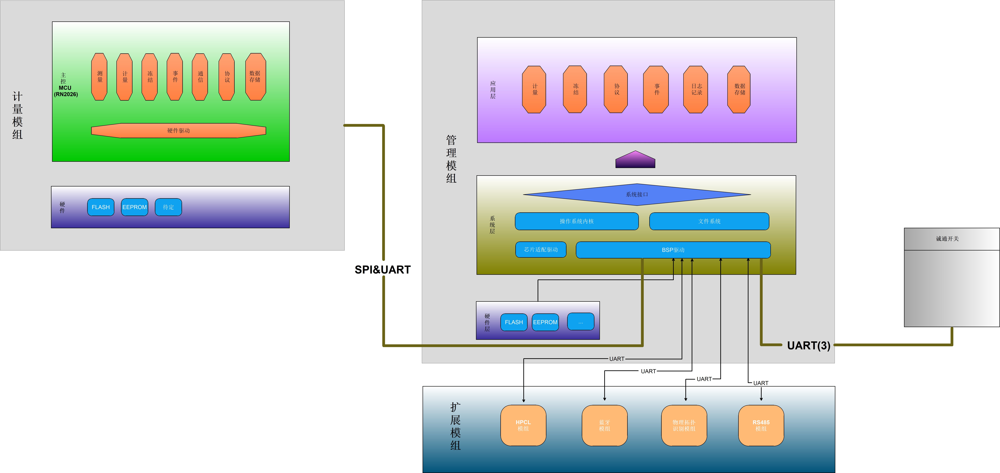
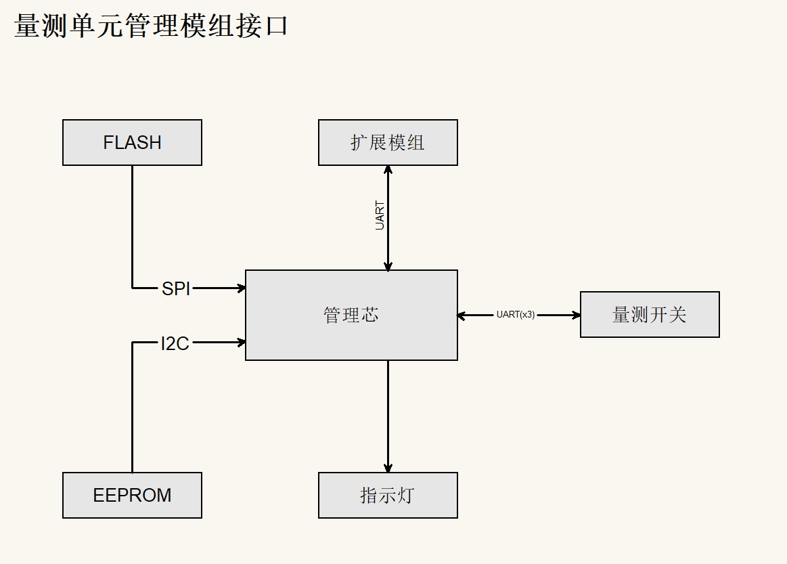
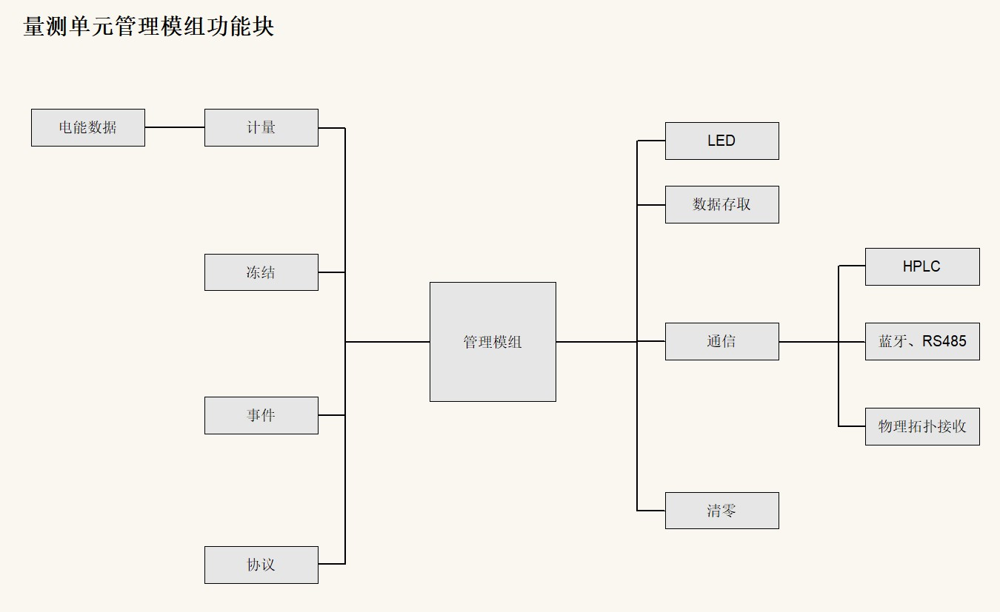
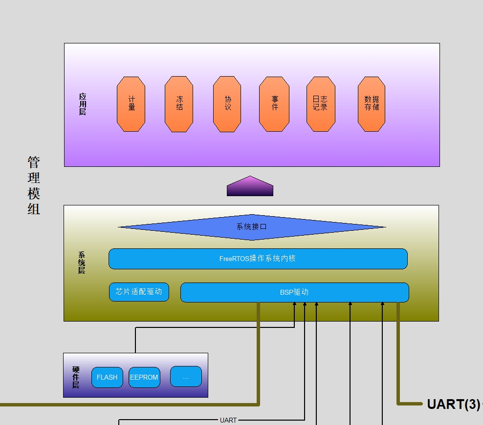

**量测单元正在运行：**

**使用场景：量测单元安装在断路器里面：**

**应用场景：**

# 量测单元简介

量测单元是一种精度为0.5S的计量设备，能与电流互感器和低压开关配合，实现配用电线路电压、电流、温度等的高精度测量，并具有载波通信、电能计量、数据冻结、事件上报与记录、物理拓扑特征电流发送与接收等功能。

## 产品链接

禅道: [智能量测开关量测单元](http://172.17.0.100:9191/zentao/product-browse-12.html)

代码: [side_insertion_measurement_module](http://172.17.0.100:8080/pdtline-intellibreaker/side-insertion-measurement-breaker/side_insertion_measurement_module)

文档设计原则

- 可以通过文档承载业务知识，新加入团队的成员可以自行通过阅读，获得“穿成线”的业务知识体系
- 可以通过文档承载产品项目信息，包括产品需求、项目需求、需求规格、产品概要设计等，可以获取产品详细设计信息。

## 量测单元架构

量测单元由计量模组、管理模组、扩展模组组成，架构如下：

- 计量模组/计量芯：计量模组软件基于万高芯片硬件平台运行，主要实现量测单元的计量，实时数据测量、分钟冻结等多功能。
- 管理模组/管理芯：该软件就是管理模组的嵌入式软件，主要实现对外通信、数据冻结、事件记录与上报等功能。
- 扩展模组：扩展分组分为载波模组、蓝牙模组、物理拓扑模组、RS485模组，主要实现量测单元的多通道通信、特征电流识别等功能。

## 管理芯硬件架构

- 管理芯：基于瑞萨芯片的核心软件平台，该嵌入式软件就是基于管理芯开发。
- FLASH：冻结记录、事件记录储存芯片。
- EEPROM：系统配置参数储存芯片。
- 扩展模组：载波、HPLC、蓝牙等扩展模组与管理芯直接相连，由管理芯控制。
- 量测开关：开关本体，实现线路保护、温度采集、远程跳闸等功能，由管理芯控制。

## 管理芯功能架构

- 计量模块
  负责发起双芯同步，与计量模组进行通信，得到双芯同步数据后储存待通信模块读取。
- 冻结模块 ：

  - 冻结模块负责实现包括分钟冻结、小时冻结、日冻结、月冻结、瞬时冻结等量测单元数据冻结存储功能。
    其中分钟冻结、小时冻结、日冻结、月冻结功能由冻结模块根据当前管理芯时间进行判断，到相应时间后进行冻结存储。瞬时冻结等约定功能则由协议或其他业务进行触发冻结存储。
  - 冻结模块负责实现协议处理的各冻结记录数据的筛选抄读数据功能。
  - 冻结模块负责实现协议处理的各冻结关联属性数据的存储、设置及抄读功能。
- 事件模块

  - 根据计量芯同步瞬时量、状态量，依据管理芯保存的事件判断门限参数， 进行事件判断，并保存事件记录。
  - 获取计量模块统计数据（电量等），并记录。
  - 根据对管理芯参数修改记录编程记录。
  - 响应协议处理的记录数据筛选。
  - 依据所记录的事件及双芯同步的状态进行事件上报（到协议处理）。
- 协议模块

  - 管理芯需支持DL/T 698.45和DL/T 645—2007协议解析。
- LED模块

  - 运行指示灯（绿色）在上电后，1s 闪烁一次。
  - 通信指示灯（黄色）在通信的时候点亮，指示正在通信。
  - 报警指示灯（红色）在告警事件（如过压、欠压）发生时闪烁。
  - 有功电能脉冲指示灯（红色），量测开关累积的有功电能量达到脉冲当量值（1kWh/脉冲常数）时发出一个脉冲。
  - 无功电能脉冲指示灯（红色），量测开关累积的无功电能量达到脉冲当量值（1kvarh/脉冲常数）时发出一个脉冲。
- 数据存取模块

  - 对需要存储的数据进行地址分配。普通数据存入EEPROM中并带CRC校验，事件和冻结类存入FLASH中。
  - 数据的存储，根据数据ID进行存储。
  - 数据的读取，根据数据ID进行读取；关于事件和冻结，可按电表要求读上n次记录。
  - 数据的擦除，根据需要进行相应数据擦除处理，如电表清零和往之前时间校时。
- 通信模块

  - 与HPLC的载波通信。
  - 与蓝牙的通信。
  - 转发物理拓扑的数据。
  - 通过RS485的通信。
- 清零

  - 清除量测开关内存储的电能量、冻结量、事件记录、负荷记录等数据。
  - 清零操作应作为事件永久记录，应有防止非授权人操作的安全措施。
  - 量测开关底度值只能清零，禁止设定。

## 管理芯软件架构

### 代码目录

管理芯嵌入式软件只需要关心根目录的**src**目录，这个目录是我们软件开发目录，其他的是瑞萨fsp软件自动生成的库文件已经一些临时文件夹等，源代码**src**结构如下图所示：

| 名称 | 描述                                                                                |
| ---- | ----------------------------------------------------------------------------------- |
| APP  | 业务逻辑层，主要功能模块的实现，如协议实现、数据冻结、事件记录与上报等              |
| FML  | 功能构件层，所有项目通用的构件，如DLT645/698框架、差分升级框架、shell框架等         |
| HAL  | 硬件抽象层，驱使硬件设备工作、实现对片内资源的通用配置，如serial、adc、硬件定时器等 |
| HDL  | 底层驱动层，和芯片相关的底层驱动，如uart、rtc、wdt等，一般由芯片厂商提供            |

### 软件架构

