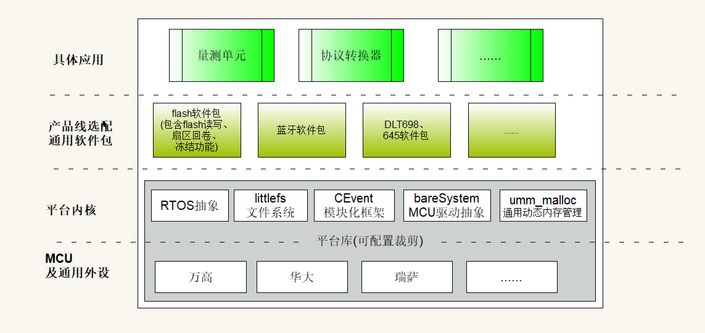

平台架构介绍
==============================

该系统架构以 “平台内核” 和 “MCU及通用外设” 组成平台静态库，然后作为整个系统的内核提供给用户。
其中RTOS抽象、littlefs文件系统、CEvent模块化框架、bareSystem MCU驱动抽象框架等均可裁剪或根据需求选配。

================

本系统结合微内核架构模型与分层模型的特点，分为四个主要层次，每个层次包含不同的功能模块。
这种分层设计有助于系统的模块化、可维护性和可扩展性。让我们从底层到顶层详细介绍每一层：

MCU及通用外设层
-------------------
这是 “平台库” 的最底层部分，核心代码为厂商提供的驱动，平台结合bareSystem与各个MCU厂商提供的驱动，将
开发好的串口驱动、IIC驱动、SPI驱动、定时器驱动等。以统一的借口通过平台对外提供服务。

- **万高、华大、瑞萨等MCU**: 这些是不同厂商的微控制器(MCU)。结合他们提供的驱动提供服务。
- **通用外设**: 包括但不限于GPIO(通用输入输出接口)、UART(通用异步收发传输器)、SPI(串行外设接口)、I2C(内部集成电路)等。这些外设使MCU能够与其他硬件组件通信和交互。
- **其他MCU**: 可扩展其他MCU。

平台内核层
----------------
这一层为最核心最重要的一层，是系统组成的关键，主要为产品应用提供通用接口、为通用软件包提供统一接口标准、基础功能等。
比如利用内核的文件系统可以为软件包flash提供均衡磨损、掉电保护等基础功能，然后flash软件包面相用户时便天然的拥有这些功能，让用户不在关心扇区翻转实现、掉电保护、擦写寿命等设计内容。

- **RTOS抽象**: RTOS是实时操作系统的缩写。这个抽象层允许上层应用不直接依赖于特定的RTOS,提高了代码的可移植性。
- **littlefs文件系统**: 最专业的嵌入式小型文件系统,低资源消耗，提供了文件存储、管理、均衡磨损、掉电保护等基础功能。
- **CEvent模块化框架**: 这是一个事件驱动的模块化框架,可解除模块之间的互相调用，有助于构建松耦合、易于维护的系统。
- **bareSystem MCU驱动抽象**: 为系统提供了MCU驱动的抽象层,简化了直接与硬件交互的复杂性。
- **UMM_MALLOC通用动态内存管理**: 为系统提供了通用动态内存管理,为所有产品线安全申请、释放内存提供迭代优化。
- **可扩展**: 内核可扩展其他框架，比如cpost通信系统，或是封装rtos通信机制作为任务间通信。

产品线选配通用软件包层
---------------------------
这一层包含了可以在不同产品线中重用的软件包。

- **flash软件包**: 提供了对闪存(Flash)进行读写操作的功能,包括扇区回卷、数据冻结、擦写寿命保护、掉电保护、关联属性表储存管理等功能。
- **蓝牙软件包**: 实现蓝牙通信功能,使设备能够与其他蓝牙设备进行无线通信。
- **DLT698、645软件包**: 特定的通信协议实现库。
- **......**

具体应用层
----------------
这是最上层,包含了面向最终用户的具体应用、产品或项目。

- **量测单元**: 量测单元项目应用代码。
- **协议转换器**: 协议转换器项目应用代码。
- **......**

系统特点
----------------
- **可配置性**: 平台库可以根据不同产品线的需求进行配置和裁剪。
- **模块化**: 每一层都由独立的模块组成,便于维护和升级。
- **抽象化**: 通过抽象层(如RTOS抽象、MCU驱动抽象)提高了代码的可移植性。
- **灵活性**: 可以根据具体需求选择不同的软件包和功能模块。

这种分层架构设计使得系统具有良好的可扩展性和可维护性。开发人员可以专注于特定层次的开发,而不需要了解整个系统的所有细节。同时,通过标准化的接口,各层之间可以独立演进,只要保持接口一致即可。

.. note::

    平台库是可配置、可裁剪的，依据需求灵活适应不同的产品线。这意味着不同的产品可以根据自身需求选择所需的功能模块,避免了不必要的资源浪费。

