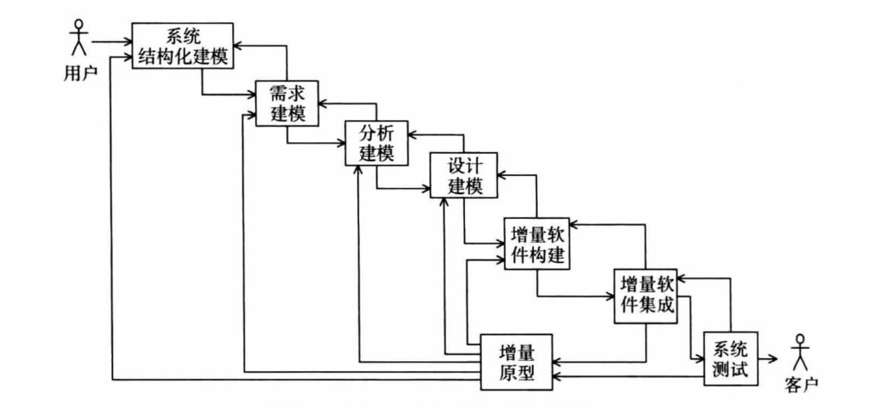

# COMET/RTE 系统和软件生命周期模型介绍

COMET/RTE是一种综合的系统和软件开发方法论。它的核心思想是通过结构化分析和全面建模来开发系统,包括硬件、软件和人员因素。这种方法的主要步骤包括:

1. 定义系统边界:明确系统与外部环境的界限。
2. 设计接口:规划硬件和软件之间的交互方式。
3. 迭代开发:基于用例和面向对象的分析设计方法,逐步完善软件。

COMET/RTE的生命周期是一个多次迭代的过程,如图4-1所示。这个过程包含两个主要部分:

1. 系统与软件建模:创建系统的全面模型,包括功能、结构和行为。
2. 连续阶段迭代:在开发的各个阶段之间进行反复优化。

值得注意的是,当采用增量开发方法时,迭代可能会跨越多个开发阶段。这种灵活性使得COMET/RTE能够适应不同规模和复杂度的项目需求。

COMET/RTE方法的优势:

- 全面性:考虑了系统的所有方面,包括硬件、软件和人员。
- 灵活性:通过迭代过程,可以适应需求变化和新发现的问题。
- 可追溯性:由于采用了系统化的建模方法,各个开发阶段之间的关系清晰可追踪。
- 风险管理:早期的系统建模有助于识别潜在风险,提前采取措施。

通过采用COMET/RTE方法,开发团队可以更好地控制复杂系统的开发过程,提高产品质量,并降低开发风险。

研究表明，需求工程和软件体系结构设计阶段的错误通常最后才被发现，这将导致高昂的错误修改成本。实时嵌入式系统的开发更是如此。COMET/RTE方法聚焦于系统反复和软件生命周期内的需求和设计。
