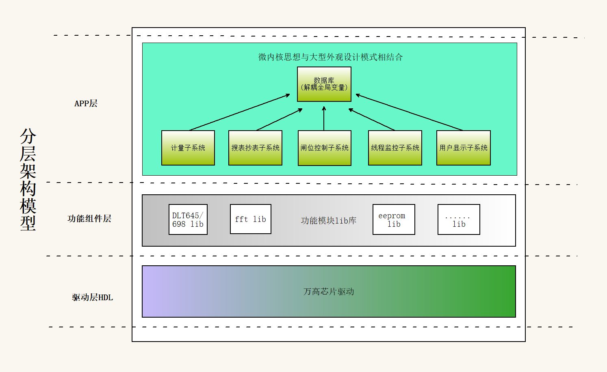

量测单元软件架构
================

1. 简介
-------

本文档描述了量测单元软件的整体架构设计。该架构巧妙地结合了分层架构、微内核架构和外观模式，以实现高度模块化、可扩展性和易维护性。
特别值得注意的是，我们创新性的通过外观模式消除了全局变量带来的耦合问题。

本文档的主要内容包括:

- 整体架构概述
- 分层架构的详细说明
- 微内核架构的实现方式
- 外观模式在解决全局变量耦合问题中的应用
- 代码示例展示
- 架构设计的总结与思考

本文档适合软件架构师、高级开发人员以及对量测单元软件架构感兴趣的技术人员阅读。

2. 整体架构
-----------

量测单元软件采用了分层架构、微内核架构和外观模式的精妙结合。这种混合架构允许我们充分利用每种模式的优势，同时最小化其缺点，尤其是在处理全局变量耦合方面取得了突破性进展。

3. 分层架构
-----------

分层架构将系统分为多个层次，每层都有特定的职责:

**驱动层(HDL):**
    该层为一个单独的文件夹，主要用于配置MCU外设的各种参数，驱使硬件设备工作，并且实现直接访问硬件设备的功能。这一层处理低级别的硬件细节，通常使用硬件描述语言（HDL）来实现。
**功能组件层(LIB):**
    该层为应用层提供已经抽象好的、货架化的功能模块组件引用，本身没有任何代码，例如DLT698、645协议库，crc校验算法库，eeprom驱动库，fft算法库等等库的引用。
**应用层(APP):**
    主要负责系统的具体功能实现，由多个子系统组成，其中微内核思想与外观模式结合用于设计数据库架构，从而在系统中实现解耦、提高灵活性和可维护性。这种设计方法的核心在于通过提供统一接口和模块化设计来管理系统的全局变量，防止系统间过多依赖和复杂耦合。

4. 微内核架构
-------------

**微内核（Microkernel）** 是一种软件设计模式，主要强调通过模块化设计将系统的核心功能与额外的服务分离开。与传统的宏内核（Monolithic Kernel）不同，微内核系统将核心职责限定在最基本的功能上，如低级硬件控制和内存管理，其他高层次的服务（如文件系统、网络协议等）都在外部模块实现。

其最大的特点就是 **插件化** 设计，各个子系统可以随意组装和拆卸。在量测单元的设计中：

微内核的理念体现在通过一个中心化的数据库模块与外部各个子系统的解耦设计。这个数据库模块起到协调者的作用，提供统一的接口和服务，核心功能简化为数据的存取和共享。
这种方式将复杂的功能（如计量、搜表、抄表等）分散到不同的子系统中，每个子系统独立工作并通过微内核式的数据库进行交互。这样，系统的扩展性和灵活性得到了增强，因为可以通过添加或替换新的服务模块，而不影响系统的核心部分。

5. 外观模式与全局变量优化
-------------------------

外观模式在我们的架构中扮演了关键角色，不仅为复杂的子系统提供了简化的接口，更重要的是，它彻底解决了全局变量带来的耦合问题。

通过外观模式，我们实现了以下优化:

1. 消除全局变量: 外观类封装了所有子系统和模块的交互，消除了对全局变量的依赖。
2. 解耦子系统: 各个子系统和模块不再通过全局变量进行通信，而是通过外观类提供的方法进行交互。
3. 集中管理状态: 需要在多个子系统间共享的状态被集中到外观类中管理，避免了分散的全局状态。
4. 简化接口: 外观类为客户端提供了一个简单统一的接口，隐藏了内部的复杂性。

这种方法使得子系统和模块之间不再因为全局变量而产生耦合，大大提高了系统的可维护性和可扩展性。

6. 代码示例
-----------

以下是一个使用量测单元软件架构的简化代码示例，展示了如何通过外观模式消除全局变量耦合:

数据接口设计：

.. code-block:: c

    #ifndef CLASS
    #define CLASS(type)           \
        typedef struct type type; \
        struct type
    #define ABSTRACT(type) CLASS(type)
    #define public
    #define private
    #define abstract
    #endif

   ABSTRACT(DataLibrariesClass_T)
    {
        private
        // Attribute----------------------------------------------------------------
        energyClass *energyObjForm;                       /* 电能类对象 */
        PhaseVariableClass *phaseVariableObjForm;         /* 分相变量对象 */
        PowerClass *powerObjForm;                         /* 功率类对象 */
        ParamVariableClass *paramObjForm;                 /* 参数变量类对象 */
        DataVariableClass *dataVariableObjForm;           /* 数据变量类对象 */
        GatherClass *gatherSearchMeterObjForm;            /* 搜表类对象 */
        EventClass *eventObjForm;                         /* 事件对象 */
        PhaseEventClass *phaseEventObjForm;               /* 分项事件对象 */
        FreezeClass *freezeObjForm;                       /* 冻结对象 */
        DeviceClass *deviceObjForm;                       /* 设备管理对象 */
        InOutDeviceClass *inOutDeviceObjForm;             /* 输入输出设备类 */
        DemandClass *demandObjForm;                       /* 需量类对象 */
        HarmonicClass *harmonicObjForm;                   /* 谐波变量类 */
    #ifdef ENABLE_ESAM_SUPPORT
        EsamClass *esamObjForm;                           /* ESAM接口类 */
    #endif
        
        encode_t Encode;
        decode_t Decode;
        getCommonData_t getCommonData;
        
        MethodClass *methodObj;                           /* 各个对象方法集合 */
        uint8_t cache[DATA_LIB_CHACHE];                   /* 数据库使用的缓存空间,需要放到所有指针后面 */
        
        abstract //依赖接口,用户需要实现
        RtcClass *rtc;
        SearchClass *search;
        CleanClass *clean;
        SystemClass *systemOperation;
        ReportIoClass *reportIo;
        SwitchTripClass *switchTrip;
        DLT645EventClass *dlt645Event;
        SwitchParameterClass *switchParameter;
        MoniterTaskClass *moniterTask;
    #if (defined(DAILY_MAX_MIN_VALUES) && defined(DLT645_PROTOCOL))
        DailyMaxMinValusClass *dailyMaxMinValus;
    #endif
    #ifdef ENABLE_ESAM_SUPPORT
        EsamInterfaceClass *esamInterface;
    #endif
        void (*changers4852Baund)(uint32_t baud);
        void (*changers4851Baund)(uint32_t baud);
        uint8_t (*eepromWrite)(uint16_t eepromAddr, void *data, uint16_t len);
        uint8_t (*eepromRead)(uint16_t eepromAddr, void *data, uint16_t len);
        uint8_t (*FlashRead)(uint32_t flashAddr, uint8_t *des, uint16_t n);
        uint8_t (*FlashWrite)(uint32_t *nextWriteAddr, uint16_t flashOneRecordSize, uint32_t flashStartAddr, uint16_t flashMaxPage,
                            void *data, uint16_t dataLen, bool isNeedAddWriteAddr); /* 需要返回下一条写入地址,flash自带扇区翻转写机制，用户不用在关心扇区翻转问题 */
        uint8_t (*FlashErase)(uint32_t flashAddr, uint16_t erase_sector_num);
        void (*UpdateParam)(uint32_t oad, uint8_t index);
        void (*module_reset_timer_start)(ResetModule_T module);
        void (*ctrlArmLed)(void);
        
        // 校表处理函数接口,用户需要实现
        uint8_t (*CalibrationOperation)(const int name, uint8_t attr, uint8_t index);   // 校表处理
        uint32_t (*GetRegisterOfMeasure)(const int name, uint8_t attr, uint8_t index);   // 读取计量芯片寄存器数据
        
        // 配置脉冲端子模式函数接口,用户需要实现
        void (*ConfigurePulseTerminalMode)(pulseTerminalMode_T pulseTerminalMode);    // 配置脉冲端子模式
        
        // Method-------------------------------------------------------------------
        public
        add_t Add; /* 增加一个对象 */
        read_t Read;
        write_t Write;
        action_t Action;
        getRecord_t GetRecord;
        selfRepair_t SelfRepair;
        getObj_t GetObj;
        uint8_t (*const get_698obj_data_decode)(DataLibrariesClass_T * const, uint32_t oad, uint8_t *const destin, uint16_t *const out_len);
        void (*cleanDataEliminateTag)(uint8_t *const source, uint16_t len);
        void (*FuncRegister)(void **dependencyInterfacePoint, void *userFunc); /* 依赖接口填入对象里面的函数指针的地址 和用户实现的具体功能 */
    };

    /**
    * @brief 增加一个对象
    *
    * @param newObj 要增加的对象指针
    * @return !0 添加出错
    */
    typedef uint8_t (*const add_t)(void *this, void *newObj);

    /**
    * @brief 获取属性
    *
    * @param oad 要读取的OAD
    * @param destin 读取的地址,hasTag为false大端放入,hasTag为true小端放入
    * @return int16_t 数据长度
    * @param bool hasTag: 返回的数据是否加数据标识tag，是true，否false，698调用时必定是true
    * @return -1 读取出错,destin[0]将填入698标准错误码
    */
    typedef uint8_t (*const read_t)(void *this, uint32_t oad, void *const destin, uint16_t *const out_len, bool hasTag);

    /**
    * @brief: 设置属性
    * @param DataLibrariesClass_T * const:
    * @param uint32_t oad: 要设置数据的OAD
    * @param void *source: 用户填入带数据类型的数据,带tag大端放入,不带tag小端放入
    * @param uint16_t n: 用户的数据长度
    * @param bool hasTag: 写入的数据是否加数据标识tag，是true，否false，698调用时必定是true
    * @return 698标准错误码
    */
    typedef uint8_t (*const write_t)(void *this, uint32_t oad, const void *const source, uint16_t n, bool hasTag);

    /**
    * @brief 调用方法并返回响应
    *
    * @param omd OI+方法名
    * @param param 参数指针，如果有参数则传入，698协议大端带数据标签
    * @param paramLen 参数长度，如果无参数则为0
    * @param pResponse 响应数据指针
    * @param pResponseLen 响应数据长度指针
    * @return uint8_t 执行结果，0表示成功，其他表示失败
    */
    typedef uint8_t (*const action_t)(void *this, uint32_t omd, const void *const param, uint16_t paramLen,
                                    uint8_t *pResponse, uint16_t *pResponseLen);

数据实体对象设计：

.. code-block:: c

    // 参数变量类
    CLASS(ParamVariableClass)
    {
        // 属性0 对象类型
        uint32_t class_offset;
        UT_hash_handle hh;
        // 属性1 逻辑名
        int name; // OI逻辑名
        // 属性2  属性2由系统参数进行派生,不在这里另设变量
        
        // 方法1 获取属性值
        uint8_t (*get)(ParamVariableClass * const, uint8_t attr, uint8_t index, uint8_t *const destin, uint16_t *const out_len, bool hasTag); // 获取index的属性值并放入destin中,并返回放入的长度,大端放入目标buf
        // 方法2 设置属性值
        uint8_t (*set)(ParamVariableClass * const, uint8_t attr, uint8_t index, const void *const source, uint16_t n, bool hasTag); /* 返回698标准错误码,大端写入 */
        // 方法3 操作
        uint8_t (*action)(ParamVariableClass * const, uint8_t method, const uint8_t *const param, uint16_t n);           /* 0成功,1失败 */
        // 方法4 自我修复功能
        void (*self_repair)(ParamVariableClass * const);
        // 方法5 恢复默认,根据属性单独初始化
        void (*reset)(ParamVariableClass * const, uint8_t attr);
    };

    // 参数变量-日期时间
    CLASS(ParamVariableDataTimeClass)
    {
        // 基类
        ParamVariableClass base;
        // 派生属性2 （日期时间）
        data_time_s time;
    };

    /* new 参数对象 */
    ParamVariableDataTimeClass DateTimeObj = { .base.name = 0x4000,
                                            .base.get = getDateTime,
                                            .base.set = setDateTime,
                                            .base.action = action,//actionBroadcastTiming,
                                            .base.self_repair = NULL,
                                            .base.reset = NULL,
                                            .time.year = 2023,
                                            .time.month = 1,
                                            .time.day = 1,
                                            .time.hour = 0,
                                            .time.minute = 0,
                                            .time.second = 0,
                                            }; /* 日期时间对象 */

外部子系统访问举例：

.. code-block:: c

    // 读取系统时间
    data_time_s systime;
    uint16_t len_temp;
    DataLibraries.Read(&DataLibraries, 0X40000200, (uint8_t *)&systime, &len_temp, false);

这个示例展示了如何使用外观模式来管理共享状态，避免使用全局变量。通过将所有子系统的引用和共享状态封装在对象中，我们实现了各个子系统之间的解耦，同时提供了一个集中的状态管理机制。

7. 总结
-------

通过巧妙结合分层架构、微内核架构和外观模式，我们不仅创建了一个灵活、可扩展且易于维护的量测单元软件架构，更重要的是，我们成功地消除了全局变量带来的耦合问题。
这种创新的架构设计使得各个子系统和模块能够独立发展、协同开发，同时保持了整体系统的协调性和一致性。这为未来的功能扩展和系统优化打造了坚实的基础。

8. 附录
-------

A. 术语表
^^^^^^^^^

- 分层架构: 将系统分为多个层次，每层都有特定的职责的软件架构模式。
- 微内核架构: 提供一个核心系统，可以通过插件进行扩展的软件架构模式。
- 外观模式: 为复杂的子系统提供一个简化的接口的设计模式。
- 全局变量: 在程序的整个生命周期内都存在的变量，可以被任何函数访问。
